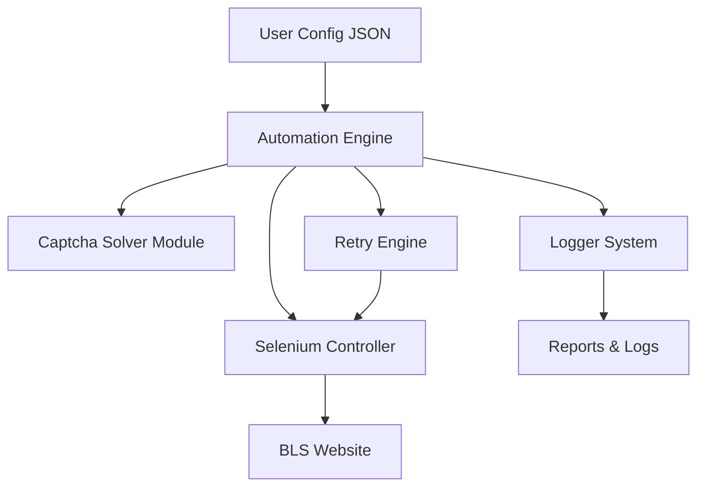
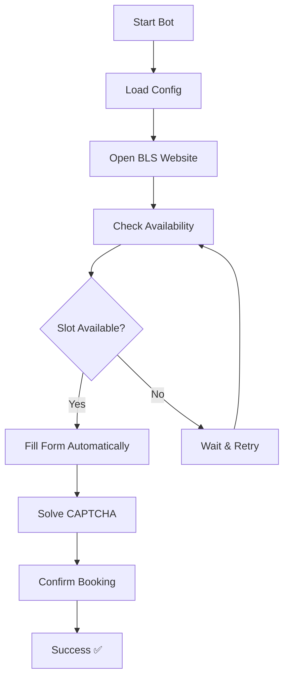
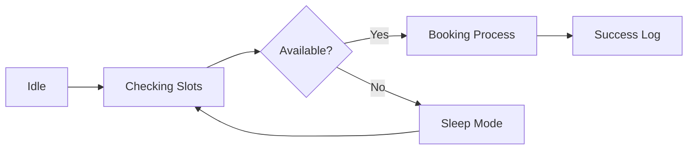

# 🚀 Mauritania BLS Appointment Bot

<div align="center">


<br/>


</div>

---

## ⚡ Overview

A high-performance automation system designed to intelligently monitor and book appointments on the **BLS Mauritania platform**.

Built with:
- Speed ⚡  
- Reliability 🧠  
- Scalability 🚀  

---

## 🧠 System Architecture



---

## 🔄 How It Works



---

## ✨ Features

### ⚡ Core Automation
- Real-time appointment checking
- Auto booking workflow
- Smart retry mechanism

### 🔐 Intelligence Layer
- CAPTCHA solving (OCR / external services)
- Smart date filtering
- Adaptive navigation handling

### 📊 Monitoring System
- Live logging
- Debug mode support
- Full execution tracking

---

## 🛠 Tech Stack

<div align="center">


</div>

---

## 📂 Project Structure

```bash
Mauritania-BLS-Bot/
│
├── booking_bot.py
├── captcha_solver.py
├── config.json
├── requirements.txt
└── README.md
```

---

## ⚙ Installation

```bash
git clone https://github.com/OnlineUnknowns/Mauritania-BLS-Bot.git
cd Mauritania-BLS-Bot
pip install -r requirements.txt
```

---

## ▶ Run

```bash
python booking_bot.py
```

---

## 📊 Live Workflow Status



---

## 💎 Premium Version

<div align="center">

<a href="https://wa.me/201286669272">

</a>

</div>

### 🚀 Premium Includes:
- Ultra-fast execution engine  
- Advanced CAPTCHA solving  
- Priority updates  
- Smart AI retry system  
- Dedicated support  

---

## 📈 GitHub Analytics

<div align="center">


</div>

---

## 👁 Visitor Counter

<div align="center">


</div>

---

## 📞 Contact

<div align="center">

<a href="mailto:Advinistrator@gmail.com">

</a>

<a href="https://wa.me/201286669272">

</a>

<a href="https://github.com/OnlineUnknowns">

</a>

</div>

---

## ⭐ Support

[](https://buymeacoffee.com/onlineunknowns)

------------------------------------------------------------------------

